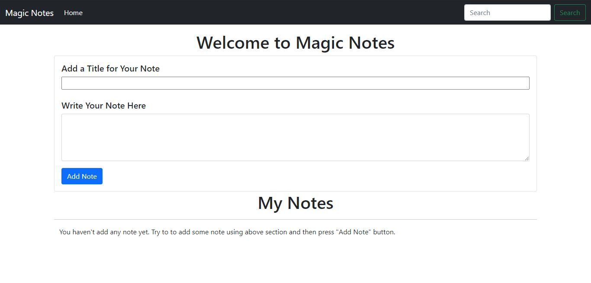

<h1 align="center">Magic Notes App</h1>

### How to Use ?

This is awesome note app where you can add you note, delete any note and search your note.
This app is build using vanilla JavaScript. You can view the app [here](https://vishal-raj-1.github.io/Magic-Notes-App/)

### Tech Stack Used
- JavaScript 
- Bootstrap( just to save time)

### Current UI

### New Features
- Add tags 
- Give different color to your note
- Give a button to delete all note at time
- Time stamp for note
- Sort Note according to Time, Tags or color

### Do You Want to contribute to this Project ?
I have commented each and everyline of JavaScript so that even a new bie to javascript can also understand what going behind the scene. If you want to implement any feature so create a issue for that then I will let you know how you can create a PR for the same !!. 
